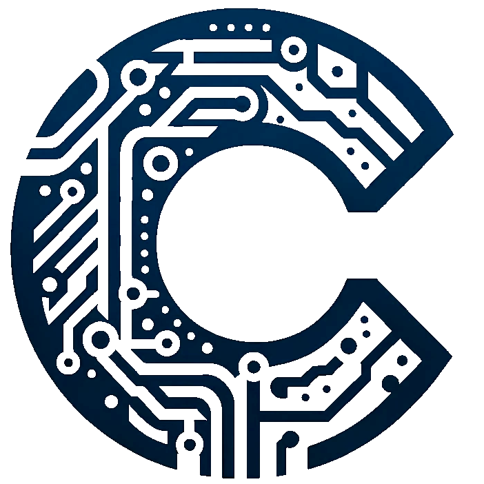

<div align="center">

<h1>Neural Operators</h1>

Learning neural operators for parameterized geometries in the context of sonic crystals and the acoustic Helmholtz equation.
The data-generation of this problem has been moved to a dedicated
[repository](https://github.com/JakobEliasWagner/Helmholtz-Sonic-Crystals) as this implementation does not directly
touch the implementation of the operators.

The backend of this project is the [Continuiti](https://github.com/aai-institute/continuiti) framework.
The Continuiti framework implements many different neural operator architectures.


[](https://www.python.org/downloads/release/python-3110/)
[](https://jakobeliaswagner.github.io/NeuralOperators/_static/codecov/index.html)
[](https://jakobeliaswagner.github.io/NeuralOperators/)
[](https://www.linkedin.com/in/jakob-wagner-65b9871a9/)
</div>

## Getting Started with Neural Operators

Welcome to Neural Operators! This guide will help you set up your development environment so you can start training and benchmarking Neural Operators for parameterized sonic crystals. Follow the steps below to install the required dependencies and get up and running.

### Installation

To install Neural Operators along with all necessary and optional dependencies, please ensure you have pip installed. Then, run the following command in your terminal:
```shell
poetry install .[dev,doc,test,optimize]
```
This command installs the Neural Operators package with various optional dependencies categorized for different purposes:

- optimize: Used to optimize models and analyze the training of operators, including libraries such as Optuna and MLFlow.
- test: Integrates pytest and pytest-cov for generating coverage reports and facilitating comprehensive testing.
- dev: Includes tools to aid in development and maintain code quality, such as Black, Ruff, and pre-commit hooks.
- doc: Provides the necessary tools to build and view the project's documentation locally.

### Running Tests

To ensure the integrity of your code and that all functionalities work as expected, run the tests provided:
```shell
pytest tests/
```
Make sure you have the test optional dependencies installed to execute the tests successfully.

### Building the Documentation

Our project comes with comprehensive documentation to help you understand and use Neural Operators effectively. You can access the online version [here](https://jakobeliaswagner.github.io/NeuralOperators/).

To build the documentation locally, ensure the doc dependencies are installed, and run the following commands:

```shell
pytest --cov=src/nos --cov-report html:doc/source/_static/codecov tests/
sphinx-apidoc -f -o docs/source/ src/nos
sphinx-build -M html docs/source docs/build
```
These commands will generate a coverage report, document the project using docstrings, and build the HTML documentation. You can find the built documentation in `docs/build/html`. Open `index.html` to view it locally.
